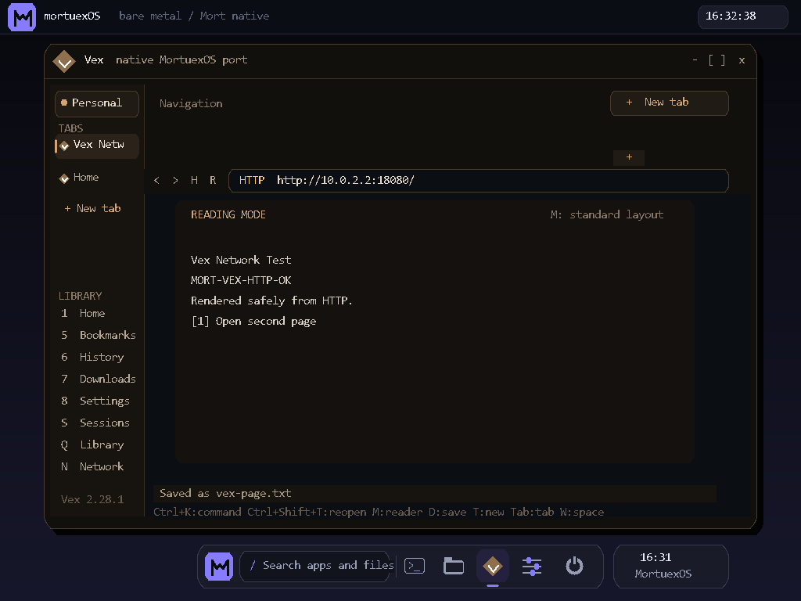

# MORT OS


**An operating-system kernel written in [Mort](https://github.com/0xmortuex/Mort) — my own programming language.** The current graphical desktop boots on QEMU and real hardware in 32-bit protected mode. A parallel, boot-tested x86-64 kernel now provides the migration foundation for running the **actual canonical Vex application** through a MortOS Chromium/Electron platform port. The framebuffer browser is a compatibility prototype, not the canonical Vex executable. MortOS also has a persistent filesystem, interactive compiled Mort programs, and its own TCP/IP stack.

## Session &amp; power

A proper session layer, the way you'd expect from a desktop OS. The top bar carries a **live clock** (read from the CMOS RTC). **`F12`** opens a **power menu** — Lock, Sleep, Restart, Shut down — with arrow-key navigation; `Esc` cancels it non-destructively (the screen under it is saved and restored). **Lock** shows a password screen (`mort`); **Sleep** blanks the display until a key; **Shut down** powers the machine off (via ACPI on emulators, or an "It is now safe to turn off your computer" halt on bare metal). Everything is a shell command too: `lock`, `sleep`, `restart`, `shutdown`, `power`.


## Networking — it serves and browses web pages

`net` brings up the RTL8139 NIC and leases an address over DHCP; `httpd` then serves an HTML page on port 80. This is the [mortnet](https://github.com/0xmortuex/mortnet) stack — NIC driver, ARP, IPv4, ICMP, UDP, DHCP, DNS, TCP, HTTP, all written from scratch in Mort — vendored into `net/` and compiled into the kernel.

`F3` opens the native **Vex browser**, which uses that same stack as an HTTP
client. It has automatically restored isolated workspaces, named tab sessions,
reopen-closed-tab, persistent tab pins and groups, duplication and reordering,
searchable persistent history and bookmarks, a command bar,
local address suggestions, private mode,
reading mode, per-origin link controls, find, link navigation, redirects,
chunked-transfer decoding, persistent Notes and Read Later, a byte-exact
download manager, and
authenticated TLS 1.3 with host pins or validated imported CA roots. See
[the browser guide](docs/browser.md) for its
controls, architecture, tests, and honest engine limits.




<sub>A web server, on an OS, over a TCP/IP stack — every layer in one language. Networking needs an RTL8139 NIC (QEMU emulates one; on real hardware, a ~$5 PCI card). The rest of the OS boots and runs on any machine.</sub>


<div align="center">

<br/><sub>MORT OS booted in QEMU — type <code>help</code>, then Enter.</sub>
</div>

## What it does

- **A graphical desktop with apps** — a multiboot linear framebuffer, an 8×16 bitmap font renderer, and a **window manager** with the MortuexOS iris identity, rounded floating windows, a searchable home surface, and a persistent app dock. `F1`/`F2`/`F3` switch between **Terminal**, **Files**, and the legacy framebuffer web prototype. Falls back to VGA text mode when no framebuffer is present.
- **A real x86-64 migration kernel** — `python build.py check64` builds a genuine ELF64 Mort kernel, four Mort processes, and a separately linked freestanding C++ process. It deterministically packages and hash-verifies all 159 shipped files from the clean canonical Vex `1b10ec5` checkout; ring 3 reads the real Vex 2.28.1 `package.json`, stats its hierarchy, and enumerates canonical directories through the read-only filesystem ABI. `python test_x86_64.py` additionally proves distinct W^X/NX address spaces, demand-paged heaps, an executed RW→RX JIT transition, C++ constructors/allocation/atomics, shared-address-space threads, FS-base TLS, futexes, descriptor pipes, blocking poll, preemptive scheduling, interruptible idle, monotonic time, fault containment, and complete reclamation. See [the canonical Vex port status](docs/vex-native-port.md) and [VexFS format](docs/vexfs.md).
- **Fail-closed entropy** — the x86-64 ABI exposes `getrandom` from bounded-retry RDRAND output. QEMU run/test commands select the modern `max` CPU model; physical CPUs without an approved entropy provider report the feature unavailable instead of returning predictable bytes.
- **Event-driven runtime foundation** — pipes and 64-bit `eventfd2` counters participate in blocking/timed `poll` and bounded `epoll`; ring-3 tests prove cross-thread wakeups, packed user tokens, interest modification/removal, and timeout delivery.
- **System V process startup** — each ELF64 process enters on a guarded stack with `argc`, `argv`, `envp`, and a real auxiliary vector, including per-process hardware-randomized `AT_RANDOM` bytes used by libc stack-protector and runtime initialization.
- **A real Settings control center** — `F4` opens searchable system settings for personalization, display, clock, storage, Ethernet, apps, privacy, power, detected hardware, accessibility, diagnostics, and maintenance. Preferences persist per user in MortFS. See [the Settings guide](docs/settings.md).


- **A real filesystem (MortFS)** — an ATA PIO disk driver and an on-disk format, both written in Mort. `ls`, `cat <file>`, `write <file> <text>`, `rm <file>`, and `run <file>` (execute a file of shell commands). Files **persist across reboots** — write a note, reboot QEMU, `cat` it back.
- **Runs real, interactive compiled programs** — `exec <file>` loads a Mort program (compiled to a flat binary) off the disk to `0x00A00000` and runs it. Programs share no symbols with the kernel; they call it through **`int 0x80` syscalls** (args passed via a fixed mailbox, since Mort's `asm()` takes no operands). A read-line syscall polls the keyboard directly, so programs can take input too — `exec ask.bin` asks your name and greets you. Sample programs are in [`programs/`](programs/).
- **Boots for real** — a BIOS+UEFI hybrid ISO (Limine bootloader) you can write to a USB stick and boot on actual hardware, not just QEMU's `-kernel` shortcut
- **Interrupt-driven keyboard** — a flat GDT, an IDT, remapped PICs; IRQ1 fires into a Mort handler (no polling)
- **A shell** — command parsing, Backspace line editing, Shift-aware scancode→ASCII, and **command history** (Up/Down arrows, decoded from 0xE0 extended scancodes)
- **PIT timer on IRQ0** (~100 Hz) with an `uptime` command
- **CPU exception handlers** — per-vector stubs that report which fault occurred (try the `crash` command)
- **Terminal scrolling** and a cursor that tracks input (a drawn underline in graphics, the hardware cursor in text mode)
- **Multiboot modules** — the bootloader passes ISO files as modules; `readme` prints one, and a second acts as a boot script the kernel runs at startup like an `/etc/rc`
- **Tested in CI-style headless runs** — `test.py` and `test_fs.py` boot the real kernel in QEMU, inject keystrokes through the monitor, and assert on VGA memory (including the write→reboot→cat persistence path)

## How it fits together

```
kmain.mx    the kernel, in Mort        ─┐
            │  mortc --freestanding      │  Mort -> freestanding C -> 32-bit object
            ▼                            │
boot.s      multiboot header + _start   ─┤  assembled to a 32-bit object
            │                            │
linker.ld   places it at 1 MB           ─┘  linked ->  build/kernel.elf
            │
            ▼
qemu-system-i386 -kernel build/kernel.elf
```

Why does a hobby language compile to C instead of running on an interpreter? **Because an interpreter can't boot.** Mort emits freestanding-friendly C, so `hello.mx` and this kernel go through the exact same compiler.

## Build & run

Requirements: Python 3, `pip install ziglang` (the C cross-compiler), and [QEMU](https://www.qemu.org/) for booting. The [Mort compiler](https://github.com/0xmortuex/Mort) is fetched automatically into `.mort/` on first build (or set `MORT_HOME`, or keep a `../Mort` checkout).

```bash
python build.py check     # build + verify it's a valid 32-bit multiboot ELF
python build.py run       # build, then boot it fullscreen in QEMU (with the disk)
```

`run` auto-creates `build/disk.img` (16 MiB, MortFS) and attaches it, so files
you `write` in the OS survive reboots. `python mkfs.py build/disk.img` wipes it
clean (add `--add host.txt:name.txt` to seed files). Try it:

```
> write notes.txt hello from mort os
> cat notes.txt
> write job.txt echo hi
> write job.txt uptime
> run job.txt
```

### Running programs

MORT OS runs real compiled programs, not just shell scripts. Sources live in
[`programs/`](programs/); `build.py disk` compiles them and seeds them onto the
image, so from the shell:

```bash
python build.py prog      # compile programs/*.mx -> build/*.bin
```
```
> exec hello.bin          # a real Mort program prints via syscall, then returns
> exec ask.bin            # an interactive program: it asks your name and greets you
```

Automated tests (all drive the real kernel headless in QEMU):

```bash
python test.py smoke      # boot + shell basics (text-mode -kernel path)
python test_fs.py         # the disk stack, incl. write-reboot-cat persistence
python test_exec.py       # build programs, seed, boot, exec, check syscall output
python test_gfx.py        # boot the ISO, screendump, assert the desktop + console rendered
python test.py settings-ui    # Settings controls, search, persistence, and screenshot
python test.py browser-ui     # Vex DHCP/TCP/HTTP, navigation, state, and screenshot
python test.py usb-hotplug    # automatic USB discovery and device inventory
```

The graphical desktop comes up on the ISO path (`run-iso`), where Limine
provides the framebuffer. The bare `-kernel` path has no framebuffer, so the
kernel falls back to VGA text mode there — which is why the text-driven tests
above still work.

### A real bootable ISO

```bash
python build.py iso       # -> build/mort.iso (BIOS + UEFI hybrid, Limine + xorriso)
python build.py run-iso   # build the ISO, then boot it in QEMU
```

Write `mort.iso` byte-for-byte to a USB stick (e.g. Rufus in "DD image" mode) and it boots on real hardware.

## Roadmap

- [x] Everything above (multi-app desktop, ATA driver, MortFS, `exec`-ing real programs)
- [ ] Space reclamation for `rm` (v1 leaks the extent; re-mkfs to compact)
- [ ] More syscalls (file I/O from programs, spawn) and a richer program ABI
- [ ] A mouse (PS/2 IRQ12) and clickable window chrome — a real GUI

## Related

- [**Mort**](https://github.com/0xmortuex/Mort) — the language this kernel is written in: lexer, parser, type checker, and C code generator, from scratch in Python with zero libraries.
