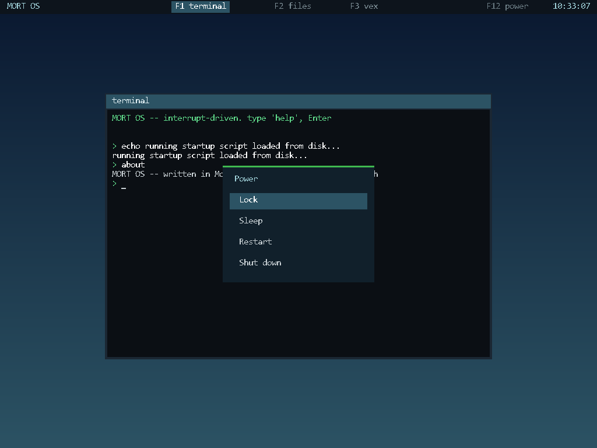
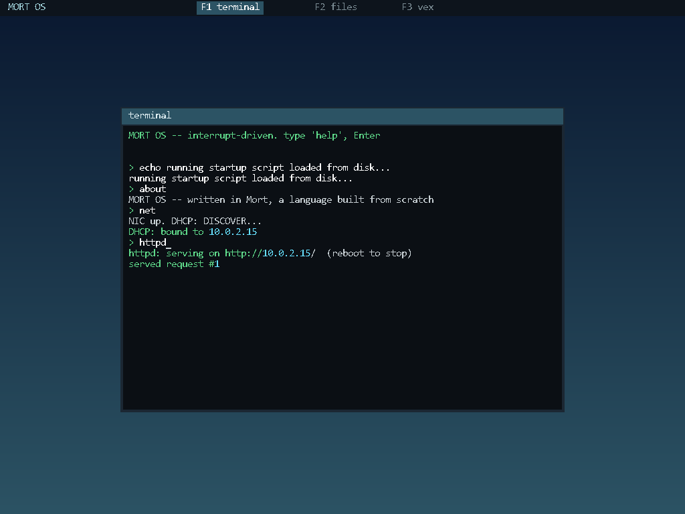
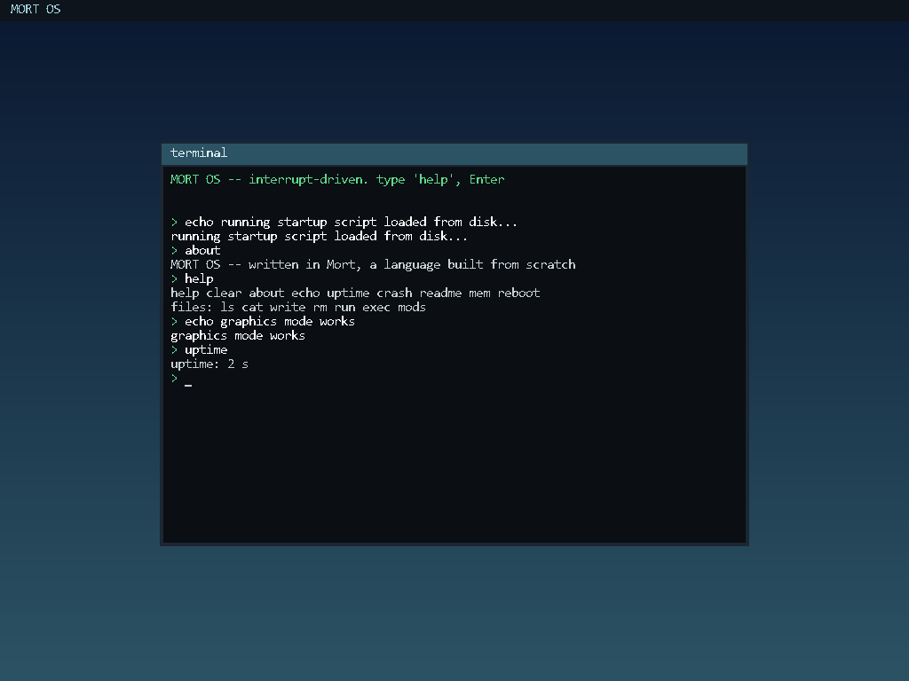
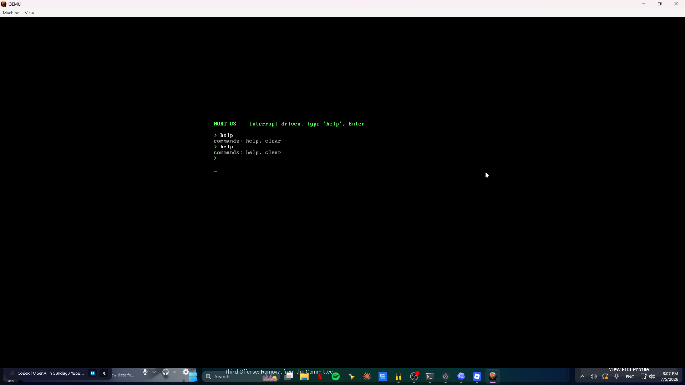
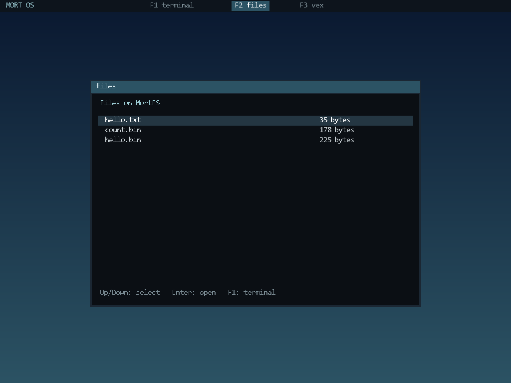

# MORT OS


-lightgrey)


**An operating-system kernel written in [Mort](https://github.com/0xmortuex/Mort) — my own programming language.** It boots on QEMU *and real hardware*, runs in 32-bit protected mode, and paints a **graphical desktop with multiple apps** — a Terminal, a Files manager, a Vex-styled browser, and a Settings control center, switched with `F1`-`F4` (or opened from an `F5` home launcher), all drawn to a linear framebuffer in a bitmap font. It has a **real filesystem** — write a file, reboot the machine, and it's still there — it **runs real, interactive compiled programs** (a `.mx` program compiled to a flat binary, loaded off the disk, talking to the kernel through `int 0x80` syscalls), and it **speaks TCP/IP**: the [mortnet](https://github.com/0xmortuex/mortnet) stack is vendored into the kernel, so MORT OS gets its own IP over DHCP and **runs a web server**. Everything above the boot stub — the framebuffer renderer, PS/2 keyboard driver, interrupt handlers, ATA disk driver, the filesystem, the syscall layer, the RTL8139 network driver, the shell — is written in Mort.

## Session &amp; power

A proper session layer, the way you'd expect from a desktop OS. The top bar carries a **live clock** (read from the CMOS RTC). **`F12`** opens a **power menu** — Lock, Sleep, Restart, Shut down — with arrow-key navigation; `Esc` cancels it non-destructively (the screen under it is saved and restored). **Lock** shows a password screen (`mort`); **Sleep** blanks the display until a key; **Shut down** powers the machine off (via ACPI on emulators, or an "It is now safe to turn off your computer" halt on bare metal). Everything is a shell command too: `lock`, `sleep`, `restart`, `shutdown`, `power`.



## Networking — it serves a web page

`net` brings up the RTL8139 NIC and leases an address over DHCP; `httpd` then serves an HTML page on port 80. This is the [mortnet](https://github.com/0xmortuex/mortnet) stack — NIC driver, ARP, IPv4, ICMP, UDP, DHCP, DNS, TCP, HTTP, all written from scratch in Mort — vendored into `net/` and compiled into the kernel. See [`docs/networking.md`](docs/networking.md) for which file implements each layer and how `net`/`httpd` actually drive it.



<sub>A web server, on an OS, over a TCP/IP stack — every layer in one language. Networking needs an RTL8139 NIC (QEMU emulates one; on real hardware, a ~$5 PCI card). The rest of the OS boots and runs on any machine.</sub>



<div align="center">

<br/><sub>MORT OS booted in QEMU — type <code>help</code>, then Enter.</sub>
</div>

## What it does

- **A graphical desktop with apps** — a multiboot linear framebuffer, an 8×16 bitmap font renderer, and a **window manager**: a top bar and `F1`-`F4` app switching (`on_key`, `kmain.mx:3503-3508`) between a **Terminal**, a **Files** manager (browse MortFS, open files), a **Vex-styled browser** app (local pages, a tribute to [Vex](https://github.com/0xmortuex/Vex)), and a **Settings** control center (personalization, clock format, network/hardware controls — `net/settings.mx`). `F5` opens a home launcher with icon tiles for all four apps plus Power (`open_launcher`, `kmain.mx:3362`). The whole shell renders to the framebuffer because only the cell-drawing primitive changed; everything else is untouched. Falls back to VGA text mode when no framebuffer is present (the bare `-kernel` path).


- **A real filesystem (MortFS)** — an ATA PIO disk driver and an on-disk format, both written in Mort. `ls`, `cat <file>`, `write <file> <text>`, `rm <file>`, and `run <file>` (execute a file of shell commands). Files **persist across reboots** — write a note, reboot QEMU, `cat` it back.
- **Runs real, interactive compiled programs** — `exec <file>` loads a Mort program (compiled to a flat binary) off the disk to `0x00A00000` and runs it. Programs share no symbols with the kernel; they call it through **`int 0x80` syscalls** (args passed via a fixed mailbox, since Mort's `asm()` takes no operands). A read-line syscall polls the keyboard directly, so programs can take input too — `exec ask.bin` asks your name and greets you. Sample programs are in [`programs/`](programs/). See [`docs/memory-map.md`](docs/memory-map.md) for every fixed physical address the kernel uses.
- **Boots for real** — a BIOS+UEFI hybrid ISO (Limine bootloader) you can write to a USB stick and boot on actual hardware, not just QEMU's `-kernel` shortcut
- **Interrupt-driven keyboard** — a flat GDT, an IDT, remapped PICs; IRQ1 fires into a Mort handler (no polling)
- **A shell** — command parsing, Backspace line editing, Shift-aware scancode→ASCII, and **command history** (Up/Down arrows, decoded from 0xE0 extended scancodes). See [`docs/shell.md`](docs/shell.md) for the full command reference.
- **PIT timer on IRQ0** (~100 Hz) with an `uptime` command
- **CPU exception handlers** — per-vector stubs that report which fault occurred (try the `crash` command)
- **Terminal scrolling** and a cursor that tracks input (a drawn underline in graphics, the hardware cursor in text mode)
- **Multiboot modules** — the bootloader passes ISO files as modules; `readme` prints one, and a second acts as a boot script the kernel runs at startup like an `/etc/rc`
- **Tested in CI-style headless runs** — `test.py` and `test_fs.py` boot the real kernel in QEMU, inject keystrokes through the monitor, and assert on VGA memory (including the write→reboot→cat persistence path)
- **PCI hardware detection, USB, and audio** — `hw_scan_pci` (`net/hardware.mx:12`) walks the PCI bus for Ethernet/Wi-Fi/audio/USB controllers; a UHCI USB 1.1 host-controller driver resets the controller and enumerates one root-port device at boot (`usb_boot_init`, `net/hci_usb.mx:195`, called from `kmain()` at `kmain.mx:3616`), setting a Bluetooth-HCI flag if the enumerated device's class matches (`net/hci_usb.mx:155`); an Intel AC'97 driver does PCI discovery, mixer volume, and PCM-out DMA (`ac97_init`, `net/audio.mx:9`), alongside a PIT-driven legacy PC-speaker beeper (`speaker_start`/`speaker_stop`, `net/hardware.mx:37`/`47`). All of it is surfaced live in the Settings app's "Hardware & Devices" page (`settings_hardware`, `net/settings.mx:280`).

## How it fits together

See [`docs/architecture.md`](docs/architecture.md) for the full boot chain,
execution model, and how the subsystems below connect, cited to source.

```
kmain.mx    the kernel, in Mort        ─┐
            │  mortc --freestanding      │  Mort -> freestanding C -> 32-bit object
            ▼                            │
boot.s      multiboot header + _start   ─┤  assembled to a 32-bit object
            │                            │
linker.ld   places it at 1 MB           ─┘  linked ->  build/kernel.elf
            │
            ▼
qemu-system-i386 -kernel build/kernel.elf
```

Why does a hobby language compile to C instead of running on an interpreter? **Because an interpreter can't boot.** Mort emits freestanding-friendly C, so `hello.mx` and this kernel go through the exact same compiler.

## Build & run

Requirements: Python 3, `pip install ziglang` (the C cross-compiler), and [QEMU](https://www.qemu.org/) for booting. The [Mort compiler](https://github.com/0xmortuex/Mort) is fetched automatically into `.mort/` on first build (or set `MORT_HOME`, or keep a `../Mort` checkout).

```bash
python build.py check     # build + verify it's a valid 32-bit multiboot ELF
python build.py run       # build, then boot it fullscreen in QEMU (with the disk)
```

The first thing on screen is the boot banner, printed at `kmain.mx:3599`, then
the shell prompt — nothing else runs automatically on this bare `-kernel`
path, since `run_script(1)` (`kmain.mx:884`) finds no multiboot module without
an ISO and returns immediately:

```
MORT OS -- interrupt-driven. type 'help', Enter
~ $
```

(`~ $` is the auto-logged-in user's home-directory prompt, drawn by
`draw_prompt`, `kmain.mx:709`-`727`.)

`run` auto-creates `build/disk.img` (16 MiB, MortFS) and attaches it, so files
you `write` in the OS survive reboots. `python mkfs.py build/disk.img` wipes it
clean (add `--add host.txt:name.txt` to seed files). Try it:

```
> write notes.txt hello from mort os
> cat notes.txt
> write job.txt echo hi
> write job.txt uptime
> run job.txt
```

### Running programs

MORT OS runs real compiled programs, not just shell scripts. Sources live in
[`programs/`](programs/); `build.py disk` compiles them and seeds them onto the
image, so from the shell:

```bash
python build.py prog      # compile programs/*.mx -> build/*.bin
```
```
> exec hello.bin          # a real Mort program prints via syscall, then returns
> exec ask.bin            # an interactive program: it asks your name and greets you
```

Automated tests (all drive the real kernel headless in QEMU):

```bash
python test.py smoke      # boot + shell basics (text-mode -kernel path)
python test_fs.py         # the disk stack, incl. write-reboot-cat persistence
python test_exec.py       # build programs, seed, boot, exec, check syscall output
python test_gfx.py        # boot the ISO, screendump, assert the desktop + console rendered
```

The graphical desktop comes up on the ISO path (`run-iso`), where Limine
provides the framebuffer. The bare `-kernel` path has no framebuffer, so the
kernel falls back to VGA text mode there — which is why the text-driven tests
above still work.

### A real bootable ISO

```bash
python build.py iso       # -> build/mort.iso (BIOS + UEFI hybrid, Limine + xorriso)
python build.py run-iso   # build the ISO, then boot it in QEMU
```

This path boots straight to the **home launcher** screen (`open_launcher`,
`kmain.mx:3362`) instead of a bare prompt — press `Esc` to reveal the
terminal underneath, where the banner and the startup script baked into the
ISO (`STARTUP_TXT`, `build.py:88`-`90`, run via `run_script(1)` at
`kmain.mx:3608`) have already executed:

```
MORT OS -- interrupt-driven. type 'help', Enter
~ $ echo running startup script loaded from disk...
running startup script loaded from disk...
~ $ about
MORT OS -- written in Mort, a language built from scratch
~ $
```

Write `mort.iso` byte-for-byte to a USB stick (e.g. Rufus in "DD image" mode) and it boots on real hardware.

## Roadmap

- [x] Everything above (multi-app desktop, ATA driver, MortFS, `exec`-ing real programs)
- [ ] Space reclamation for `rm` (v1 leaks the extent; re-mkfs to compact)
- [ ] More syscalls (file I/O from programs, spawn) and a richer program ABI
- [ ] A mouse (PS/2 IRQ12) and clickable window chrome — a real GUI

## Related

- [**Mort**](https://github.com/0xmortuex/Mort) — the language this kernel is written in: lexer, parser, type checker, and C code generator, from scratch in Python with zero libraries.
